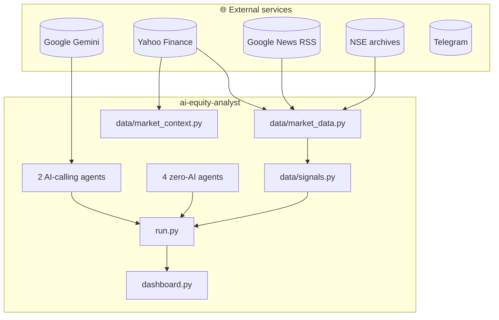

# How It Works — the full tour

This document explains, in plain English, **exactly** what happens when you
run `python run.py`: which files run, which ones call Google's Gemini AI,
which ones are just doing arithmetic, which real websites/APIs get hit, and
what formula produces every number you see. If [README.md](README.md) is
the map, this is the guided tour with a magnifying glass.

No prior finance or programming knowledge assumed — every term is defined
where it's first used, and a glossary sits at the bottom.

---

## The one-sentence version

The app pulls real numbers from a few free websites, does a lot of ordinary
math on them (moving averages, volatility, etc.), and only asks an AI
model for help on the two things pure math can't do: **reading news** and
**weighing conflicting evidence into one final decision**.

---

## Part 1 — The architecture diagram, explained box by box

**What each box actually is, in plain words:**

- **Yahoo Finance** — the same company behind finance.yahoo.com. We use a
  free Python library called `yfinance` to ask it for a stock's daily
  price/volume history and some company facts (revenue growth, debt, etc.).
  No signup, no key, no cost.
- **Google News RSS** — Google News has a free "search feed" you can fetch
  like a webpage, no login needed. We ask it for recent articles about a
  company and get back real headlines.
- **NSE archives** — the National Stock Exchange of India publishes plain
  spreadsheet files (CSVs) listing exactly which 50 (or 500) companies are
  in the Nifty 50/500 index today. We download those directly.
- **Google Gemini** — the actual AI model. This is the only paid/keyed
  service, and the only one that "thinks" rather than just fetching facts.
- **Telegram** — a messaging app; its "Bot API" lets a program send you a
  chat message. Optional — only used if you set up a bot.
- **`data/market_data.py`** — the file that actually calls Yahoo Finance
  and Google News and turns the raw response into a clean Python dictionary
  ("bundle") per stock.
- **`data/signals.py`** — no network calls at all. Takes the price history
  `market_data.py` already fetched and computes real statistics from it
  (RSI, volatility, beta, etc.) — pure arithmetic.
- **`data/market_context.py`** — fetches the Nifty 50 index itself (once
  per run, not once per stock) so every stock's move can be judged *relative
  to the market*, not in isolation.
- **The 4 zero-AI agents** — Research (Scout), Fundamental (Analyst),
  Technical (Chart Reader), Risk (Skeptic). Each is a plain Python file
  with a scoring formula. Zero calls to Gemini.
- **The 2 AI-calling agents** — News/Event Reader and Decision Agent
  (Manager). These are the only two places the app pays for and waits on
  an AI response.
- **`run.py`** — "the conductor." Calls everything above in order and
  glues the results together.
- **`dashboard.py`** — a web page (built with Streamlit) that shows you the
  results and can trigger `run.py` for you.

---

## Part 2 — Which agent calls AI, and which is just math

| Agent | File | Calls Gemini? | How many times per run |
|---|---|---|---|
| Research Agent (Scout) | `agents/research_agent.py` | ❌ No | 0 |
| Fundamental Agent (Analyst) | `agents/fundamental_agent.py` | ❌ No | 0 |
| Technical Agent (Chart Reader) | `agents/technical_agent.py` | ❌ No | 0 |
| Risk Agent (Skeptic) | `agents/risk_agent.py` | ❌ No | 0 |
| News/Event Reader | `agents/sentiment_agent.py` | ✅ Yes | **1**, for every shortlisted stock together (not one call each) |
| Decision Agent (Manager) | `agents/decision_agent.py` | ✅ Yes | **1**, for every shortlisted stock together |
| Profile structuring | `profile/profile_loader.py` | ✅ Yes (only if you gave a non-JSON profile file) | 0 or 1, once, not per stock |

So a typical run makes **2 AI calls total** (or 3 if you're using a
text/PDF profile instead of the dashboard's form). Compare that to the
very first version of this app, which called Gemini **~23 times** per run
— once per specialist agent, per stock.

**Why can four "analysts" run without any AI at all?** Because their job
has an *exact mathematical answer*. "Is the stock above its 50-day average
price?" isn't a judgment call — it's a comparison of two numbers. Asking an
AI to do that would be like hiring a consultant to tell you whether 7 is
bigger than 5. The two agents that *do* use AI have jobs a formula
genuinely can't do: understanding what a news headline *means*, and
weighing four different, sometimes-contradictory opinions (great business,
weak chart, mixed news, risky liquidity) into one coherent recommendation —
that's a judgment call, not arithmetic.

---

## Part 3 — Following one stock through an entire run

Let's trace a single stock — **TCS** — from the moment `run.py` starts to
the moment it either makes the final shortlist or doesn't. All numbers
below are realistic examples, not the exact output of any specific run.

### Step 0 — Real market context (`data/market_context.py`)
Before looking at any individual stock, the app fetches the **Nifty 50**
index's own price history from Yahoo Finance (ticker `^NSEI`) — once, for
the whole run. Today, say, the Nifty is **down 0.9%**.

*Why first?* Because "TCS fell 2%" means something completely different if
the whole market fell 3% that day (TCS actually did *better* than average)
versus if the market was flat (TCS's drop is real, stock-specific news).

### Step 1 — Fetch TCS's real data (`data/market_data.py`)
The app asks Yahoo Finance for `TCS.NS` (`.NS` = NSE-listed) and gets:
- A year of daily open/high/low/close/volume prices.
- Company facts: revenue growth, profit margins, debt levels, valuation
  ratios, sector ("Information Technology"), etc. — whatever Yahoo actually
  publishes for TCS (not every field exists for every company; missing
  ones are simply left out, never invented).

It also asks Google News for `"TCS NSE stock"` and gets back, say, 6 recent
headlines like *"TCS shares fall on weak Q1 guidance"*.

If Yahoo has no data at all for a symbol (typo, delisted, etc.), that
symbol is **skipped and logged** — it doesn't crash the whole run.

### Step 2 — Turn raw data into real signals (`data/signals.py`)
Still zero AI. Plain formulas turn the raw price history into:
- **RSI** (Relative Strength Index) — a 0-100 number showing if recent
  price moves have been mostly up or mostly down. Above 70 = "overbought"
  (may be due for a pullback); below 30 = "oversold."
- **Moving averages** (50-day, 200-day) — the average closing price over
  the last 50/200 trading days; comparing today's price to these tells you
  the trend direction.
- **Volatility** — how much the stock's daily price swings, expressed as
  an annualised percentage (higher = wilder stock).
- **Beta** — how much TCS moves relative to the Nifty. Beta of 1.2 means
  "when the market moves 1%, TCS tends to move ~1.2%."
  Beta of 1.5 would push its **Risk Score up**.
- **Max drawdown** — the worst peak-to-trough price crash in the last year,
  e.g. "-22% at its worst point."
- **Relative strength** — TCS's return minus the Nifty's return, over the
  last 1/3/6 months — is TCS *beating* or *lagging* the market.
- **Volatility anomaly (z-score)** — how unusual today's move is *for this
  specific stock*. A 3% move is huge for a normally-calm stock but nothing
  for a normally-wild one; this number accounts for that.
- **Historical P/E context** — TCS's current valuation compared to *its
  own* valuation range over the last year (cheap/fair/expensive *for TCS*,
  not against some generic "27x is expensive" rule).

### Step 3 — The Scout decides if TCS is worth a closer look (`agents/research_agent.py`)
Zero AI. A formula combines: how far TCS moved *relative to the Nifty*,
how unusual that move is for TCS specifically, the volume spike, whether
it broke a 20-day high, and whether it gapped up/down overnight — into one
**anomaly score**. All ~50 (or however many) scanned stocks get this score;
the ~5 highest scores become the "watchlist." If TCS isn't in the top 5,
its story ends here for today — no further analysis is wasted on it.

Say TCS scores high because it fell 2% while the Nifty only fell 0.6% (a
real relative underperformance) on 1.8x normal volume. It makes the
watchlist.

### Step 4 — Three pure-math specialists score TCS

**The Analyst** (`agents/fundamental_agent.py`) — starts at a baseline
score of 5/10, then adjusts up for good revenue growth/ROE/margins, down
for high debt, and up/down depending on whether TCS's current valuation
sits in the cheap or expensive end of its *own* historical range. Zero AI —
just addition and subtraction on real numbers. Might land at, say, 9/10
with the label "Strong business quality; valuation looks fair relative to
its own history."

**The Chart Reader** (`agents/technical_agent.py`) — same idea: starts at
5/10, adjusts for trend (is price above both moving averages — bullish —
or below both — bearish), RSI extremes, whether it's near its 52-week
high, volume confirmation, and relative strength vs the Nifty. Might land
at 4/10 with "Downtrend, RSI 38, off 52-week highs, 1.8x volume, -2.1% vs
Nifty over 1m, ATR ₹42 (typical daily range)."

**The Skeptic** (`agents/risk_agent.py`) — starts at 0 ("no risk") and adds
points for thin liquidity, high volatility, high beta, deep drawdowns, and
large overnight gaps. Might land at 2/10 (fairly low risk — TCS is highly
liquid and not especially volatile) with the flag "No major red flags in
the available real data."

### Step 5 — The News/Event Reader reads real headlines (`agents/sentiment_agent.py`) — **AI call #1**
This is the first of only two AI calls, and it happens **once for every
shortlisted stock together**, not once per stock. Before the AI even sees
anything, the code clusters near-duplicate headlines — if 4 different
publishers all wrote about the same "TCS misses Q1 estimates" story, that
becomes ONE entry noting "4 sources," not 4 separate texts (this both saves
money and stops one real story from *seeming* more important just because
many outlets copied it).

Gemini is then asked, for TCS and every other shortlisted stock at once:
"what actually happened, how material is it, and what's the sentiment?" It
might reply: *sentiment: negative, event_type: earnings, materiality: high,
summary: "TCS shares fell after missing Q1 revenue estimates and citing
cautious client spending."*

### Step 6 — Memory reports what changed (`memory/memory_layer.py`)
Zero AI. Before the final decision, the app checks: did we analyse TCS
before? If so, it pulls up the last real recorded price and scores and
computes a genuine comparison: *"Previous call (2 days ago): hold; price
₹3,450 → ₹3,390 (-1.7% since); technical 5 → 4; risk 2 → 2."* This is a
real diff, not a summary written by AI.

### Step 7 — The Manager makes the final call (`agents/decision_agent.py`) — **AI call #2**
The second and last AI call. Gemini receives, **for every shortlisted stock
at once**: the real scores and labels from Steps 4-6 above, the real Nifty
context from Step 0, your investor profile, and the real sector mix of
today's watchlist (e.g. "3 of 5 stocks are IT — check you're not
over-concentrating"). It's asked to produce, per stock: an opportunity
score (0-100), a confidence score kept *deliberately separate* from
opportunity (a stock can look attractive but score low confidence if the
underlying data was thin or stale), a bull case, a bear case ("why might
this view be wrong?"), a stance (accumulate/hold/avoid), a reference target
price with reasoning, portfolio fit, and an "invalidation condition" —
what future evidence would change the AI's mind.

**One thing the AI is *not* asked to do:** decide how many shares to buy.
That number — `suggested_quantity` — is computed afterward in plain Python
from **your real stated capital** and **your real max-position-size rule**,
scaled down automatically if the stock's own risk score is high. It's
never an AI guess.

### Step 8 — Save and send
The finished shortlist is saved to `output/analysis_2026-08-18.json`, sent
to your Telegram (or printed, if not configured), and today's real scores
are stored in Memory for tomorrow's delta comparison.

---

## Part 4 — Every real formula used, in plain English

All of these live in `data/signals.py` and run with zero AI, zero network
calls (they operate on price history already fetched).

| Signal | Plain-English formula | What it tells you |
|---|---|---|
| **% change** | (today's price − yesterday's price) ÷ yesterday's price × 100 | Did it go up or down, and by how much |
| **Moving average (SMA)** | Average closing price over the last N days | The general trend direction |
| **RSI** | Ratio of "average size of up-days" to "average size of down-days" over 14 days, squashed to 0-100 | Overbought (>70) or oversold (<30) |
| **ATR (Average True Range)** | Average of the last 14 days' true trading range (high-low, accounting for overnight gaps) | The stock's typical daily "wiggle room" in ₹ |
| **Historical volatility** | Standard deviation of daily % returns, scaled to a yearly figure | How wildly the stock normally swings |
| **Downside volatility** | Same as above, but only counting days it went *down* | How rough the bad days specifically are |
| **Beta** | How much the stock's daily moves track the Nifty's daily moves | >1 = amplifies market moves, <1 = dampens them |
| **Max drawdown** | The worst percentage drop from any peak to the lowest point after it, in the lookback window | The worst-case scenario you'd have lived through |
| **Relative strength** | Stock's % return minus the Nifty's % return, over the same period | Is it beating or lagging the market |
| **Gap %** | (today's opening price − yesterday's closing price) ÷ yesterday's close × 100 | Did something happen overnight (news, earnings) |
| **Volatility anomaly (z-score)** | Today's return ÷ the stock's own typical daily swing | Is today's move big *for this stock specifically* |
| **Trend structure** | Compares today's price to the 50-day and 200-day averages | Labels it strong uptrend / recovery / downtrend / sideways |
| **Historical P/E context** | Where today's valuation sits between the cheapest and most expensive the stock has been over the last year | Cheap/fair/expensive *relative to itself*, not a generic rule |

---

## Part 5 — Every real API/data source, precisely

| What | Exact source | Called from | Needs a key? |
|---|---|---|---|
| Stock prices/volume | `yfinance` library → Yahoo Finance, ticker `SYMBOL.NS` | `data/market_data.py` | No |
| Company fundamentals | Same `yfinance` call's `.info` dictionary (revenue growth, ROE, debt, valuation ratios, sector...) | `data/market_data.py` | No |
| Nifty 50 index | `yfinance`, ticker `^NSEI` | `data/market_context.py` | No |
| News headlines | Google News RSS search feed (`news.google.com/rss/search?q=...`) | `data/market_data.py` | No |
| Nifty 50/500 constituent lists | NSE's public CSV files (`archives.nseindia.com/.../ind_nifty50list.csv`) | `data/nse_universe.py` | No |
| AI reasoning | Google Gemini, via the official `google-genai` Python SDK | `agents/base_agent.py` (shared by the 2 AI agents) | **Yes** |
| Sending the alert | Telegram Bot API (`api.telegram.org/bot<token>/sendMessage`) | `alerts/telegram_alert.py` | Yes, optional |
| Storing memory | ChromaDB, a small local vector database (no internet involved) | `memory/memory_layer.py` | No |

---

## Part 6 — Glossary (for the non-finance reader)

- **RSI (Relative Strength Index)**: a 0-100 score measuring recent
  momentum. Not "strength" like a company's balance sheet — it's purely
  about recent price direction.
- **Moving average**: the average price over the last N days. A "50-day
  moving average" smooths out daily noise to show the medium-term trend.
- **P/E ratio**: price-to-earnings — how many years of current profit it'd
  take to "pay back" the stock's price. Higher usually means the market
  expects faster future growth (or the stock is simply expensive).
- **ROE**: return on equity — how much profit a company generates per
  rupee of shareholder money invested in it.
- **Volatility**: how much a stock's price swings around, regardless of
  direction. High volatility = bigger daily surprises, both up and down.
- **Beta**: a stock's tendency to amplify or dampen the broader market's
  moves. Beta 1.5 → tends to move 1.5x whatever the Nifty does that day.
- **Drawdown**: the size of a decline from a previous peak. "Max drawdown
  -30%" means at its worst, the stock was 30% below its recent high.
- **Liquidity / turnover**: how much rupee value of the stock trades
  hands per day on average — low liquidity means it could be hard to sell
  a large position quickly without moving the price against you.
- **Basis point / percentile**: "percentile in own range" of 20 means
  today's valuation is near the cheap end (20% of the way up) of where
  this stock has traded over the lookback window.

---

## Still have questions?

Read the source — every file above has a docstring at the top written in
the same plain style as this document, and every function name says what
it does. Start with `run.py`; it calls everything else in order.
