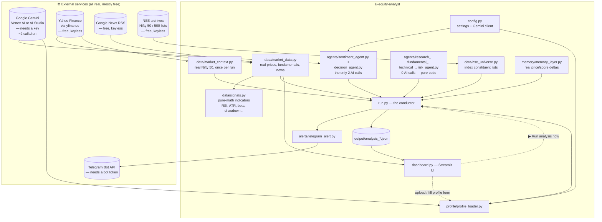
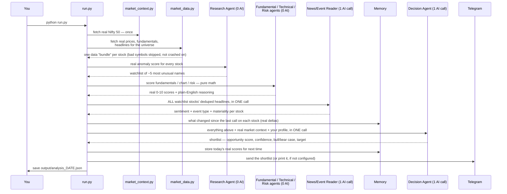

# 🧠 AI Equity Analyst

An **agentic AI** that behaves like a small equity research desk for the
**Indian stock market** — powered by Google **Gemini**, real Yahoo Finance
prices, and real news.

Instead of you opening a stock screener and manually checking 50–500
companies every morning, a team of AI "specialists" does it for you and
hands you a short, reasoned shortlist of 2–3 high-conviction ideas — with
its reasoning shown, not hidden.

> **Not a chatbot. Not a buy/sell signal generator.**
> A workflow that *observes → reasons → prioritises → acts*.
>
> **Everything it looks at is real.** There is no demo mode and no
> rule-based fallback anywhere in this codebase. If Gemini or a data source
> can't be reached, the app stops and shows you the real error — it never
> quietly substitutes a fake number to keep going.
>
> **Only ~2 AI calls per run**, no matter how big the universe is. Most of
> what looks like "AI analysis" is actually plain, transparent math on real
> data — AI is reserved for the two things a formula genuinely can't do:
> reading news, and weighing conflicting evidence into a final call.

📖 **Want the deep-dive?** [HOW_IT_WORKS.md](HOW_IT_WORKS.md) walks through
every agent, every file, every API call and every formula in plain English
with worked examples — this README is the map, that document is the tour.

---

## 📖 Read this first (the idea in plain English)

Think of it like **hiring a small team**. Four of them are pure calculators
(no AI, just real numbers and formulas); two are the ones who actually
"think."

| Who | Nickname | What they do | AI calls? |
|-----|----------|---------------|-----------|
| **Research Agent** | The Scout | Scores every stock by a real "anomaly score" — move vs the Nifty 50, unusual volume, breakouts, gaps — and picks the ~5 most unusual. | **0** — pure math |
| **Fundamental Agent** | The Analyst | Scores business quality from real revenue growth, ROE, margins, debt, cash flow, and valuation vs the stock's *own* historical range. | **0** — pure math |
| **Technical Agent** | The Chart Reader | Scores the real price chart — trend structure, RSI, relative strength vs Nifty, breakouts. | **0** — pure math |
| **Risk Agent** | The Skeptic | Scores downside risk from real volatility, beta, max drawdown, liquidity, gap risk. | **0** — pure math |
| **News/Event Reader** | (was "Sentiment Agent") | Reads real, deduplicated headlines for **all** shortlisted stocks and extracts what happened, how material it is, and the sentiment. | **1**, batched across every stock |
| **Decision Agent** | The Manager | Weighs every real signal above plus your profile and produces the final shortlist — bull case, bear case, confidence, target price, portfolio fit. | **1**, batched across every stock |

The big shift: instead of **you** reading everything, the system reads it,
argues it out internally, and gives you a short answer you can act on — and
it does that for ~₹1-2 worth of AI tokens per run, not per stock.

---

## 🗺️ Architecture — what talks to what



**No MCP servers are used anywhere in this app.** Every connection above is a
plain, direct HTTP call or SDK call — `requests` for Google News/NSE/Telegram,
the `yfinance` library for Yahoo Finance, and the `google-genai` SDK for
Gemini.

---

## 🔁 What happens during one run — step by step



If **any** step fails — Gemini unreachable, Yahoo rate-limiting a symbol —
that step raises with a full error. A single bad symbol is now *skipped*
(logged, not fatal) since the data-quality gate was added; a Gemini outage
still stops the whole run, since there's no fallback to silently degrade to.

---

## 🧩 What each file is (so nothing feels like a black box)

```
ai-equity-analyst/
├── run.py                    ← the ONE file that runs the full pipeline
├── dashboard.py               ← Streamlit UI: profile builder, browse runs, trigger a run
├── config.py                  ← reads .env, logs in to Gemini
├── .env.example                ← copy this to .env and add your settings
├── requirements.txt             ← the Python libraries to install
├── sample_profile.txt            ← an example investor profile you can edit
│
├── agents/
│   ├── base_agent.py          ← shared skill: "ask Gemini, get JSON back, or raise"
│   ├── research_agent.py      ← The Scout — 0 AI calls, real anomaly scoring
│   ├── fundamental_agent.py   ← The Analyst — 0 AI calls, real business-quality scoring
│   ├── technical_agent.py     ← The Chart Reader — 0 AI calls, real chart scoring
│   ├── risk_agent.py          ← The Skeptic — 0 AI calls, real risk scoring
│   ├── sentiment_agent.py     ← News/Event Reader — 1 batched AI call for all stocks
│   └── decision_agent.py      ← The Manager — 1 batched AI call for all stocks
│
├── data/
│   ├── market_data.py         ← real prices/fundamentals/news/liquidity (Yahoo + Google News)
│   ├── signals.py             ← pure-math indicators: RSI, ATR, beta, drawdown, volatility...
│   ├── market_context.py      ← real Nifty 50 fetched once per run
│   └── nse_universe.py        ← fetches live Nifty 50 / Nifty 500 lists from NSE
│
├── memory/memory_layer.py     ← The Notebook — real price/score deltas since your last call
├── profile/profile_loader.py  ← reads your profile file (PDF/XLSX/HTML/DOCX/TXT/JSON)
├── alerts/telegram_alert.py   ← sends the shortlist to Telegram (or prints it)
└── output/                    ← each run's full analysis, saved as JSON
```

For exactly what each file does internally — every function, every real
formula, every API endpoint — see **[HOW_IT_WORKS.md](HOW_IT_WORKS.md)**.

---

## 🌐 Where every piece of data actually comes from

| Source | What it provides | Used by | Key needed? |
|---|---|---|---|
| **Google Gemini** | News interpretation + final decision synthesis (~2 calls/run) | `agents/sentiment_agent.py`, `agents/decision_agent.py`, plus profile structuring | ✅ yes |
| **Yahoo Finance** (`yfinance`) | Real daily price/volume/OHLC history, real company fundamentals (ROE, margins, debt, cash flow, valuation ratios), the Nifty 50 index itself | `data/market_data.py`, `data/market_context.py` | ❌ free |
| **Google News RSS** | Real, current headlines per stock | `data/market_data.py` (fetch) → `agents/sentiment_agent.py` (interpret) | ❌ free |
| **NSE archives** | Official Nifty 50 / Nifty 500 constituent symbol lists | `data/nse_universe.py` | ❌ free |
| **Telegram Bot API** | Delivers the finished shortlist to your phone | `alerts/telegram_alert.py` | ✅ yes (optional) |
| **ChromaDB** (local) | Stores real price/score history per stock for the audit/delta system | `memory/memory_layer.py` | ❌ local, no key |
| **your file or the dashboard form** | Your investor profile | `profile/profile_loader.py` | ❌ local |

Everything else — RSI, moving averages, beta, drawdown, volatility, ATR,
relative strength, anomaly scores, position sizing — is **plain Python math**
on the real numbers above, computed in `data/signals.py`. No API, no AI.

---

## ⚠️ Known gaps — honest limitations

- **ROCE, promoter shareholding/pledge %, earnings quality** — no free data
  source exists; these are never asked about rather than guessed. Need a
  paid provider (Screener.in, Trendlyne, an NSE filings feed) to add.
- **Sector-relative market context** — the Scout compares each stock only
  to the broad Nifty 50, not to a sector index (e.g. Nifty IT). There's no
  clean free mapping from stock → sector index, so this was deliberately
  left out rather than guessed.
- **Portfolio fit is watchlist-level, not real-holdings-level** — this app
  doesn't track your actual brokerage holdings, so "portfolio fit" reflects
  sector concentration *within today's shortlist*, not your real portfolio.
- **No earnings-calendar / event-proximity risk** — flagging "results due in
  3 days" needs a free, reliable earnings calendar source, which wasn't
  wired in.

---

## 🚀 Getting started — step by step

**Step 1 — Install Python 3.10+ (or use `uv`)**
```bash
python3 --version
```

**Step 2 — Install the libraries**
```bash
cd ai-equity-analyst
uv pip install -r requirements.txt      # or: pip install -r requirements.txt
```

**Step 3 — Create your settings file**
```bash
cp .env.example .env
```

**Step 4 — Connect Gemini** (pick **one** method)

#### Method 1 — Google AI Studio API key (easiest)
1. Go to **https://aistudio.google.com/apikey** and create a free API key.
2. In `.env`:
   ```
   GOOGLE_AUTH_MODE=token
   GOOGLE_GENAI_USE_VERTEXAI=FALSE
   GOOGLE_API_KEY=paste-your-key-here
   ```

#### Method 2 — Google Cloud / Vertex AI
1. Install the gcloud CLI, then log in:
   ```bash
   gcloud auth application-default login
   ```
2. Enable the Vertex AI API on your project (one time):
   ```bash
   gcloud services enable aiplatform.googleapis.com --project YOUR_PROJECT
   ```
3. In `.env`:
   ```
   GOOGLE_AUTH_MODE=adc
   GOOGLE_GENAI_USE_VERTEXAI=TRUE
   GOOGLE_CLOUD_PROJECT=your-project-id
   GOOGLE_CLOUD_LOCATION=europe-west2
   ```

> `GOOGLE_AUTH_MODE=auto` tries Vertex AI first, then falls back to the API
> key — handy if you're not sure which will work.

**Step 5 — Run it**
```bash
uv run python run.py       # or: python run.py
```

The header prints `Gemini login: adc (connected)` or `token (connected)`
when it worked. If it says `NOT CONNECTED`, `run.py` stops immediately with
the reason — fix `.env` and re-run. Market data (Yahoo Finance, Google
News, NSE lists) needs no key at all.

---

## 📊 Using the dashboard

A Streamlit UI sits on top of the same pipeline:

```bash
uv run streamlit run dashboard.py
```

Opens at `http://localhost:8501`. From there you can:

- **Build your investor profile** — optionally upload a PDF/XLSX/DOCX
  document (parsed automatically), and always fill in a dropdown form
  (risk appetite, capital, horizon, preferred/excluded sectors, max
  position size). Your form answers always win over the document; whichever
  fields the form doesn't cover are filled from the document if you
  uploaded one. Saved as JSON — which the next run loads **without an extra
  Gemini call**, since it's already structured.
- **Browse any past run** — pick a date, see the shortlist as cards
  (opportunity score, confidence, bull/bear case, action, portfolio fit,
  suggested quantity), and expand each stock for its real score breakdown,
  6-month price chart, and the real headlines behind its news verdict.
- **Edit `UNIVERSE` / `TOP_N`** — written straight to `.env`. Gemini/Telegram
  credentials are intentionally **not** editable here — they're secrets,
  not day-to-day knobs, so they stay `.env`-only.
- **Trigger a new run** — a button that runs the full pipeline in the
  background and shows the live log.

---

## 🔢 Choosing what to scan (`UNIVERSE`)

In `.env`:
```
UNIVERSE=NIFTY50
```
- `NIFTY50` / `NIFTY500` — fetches the real, current constituent list
  straight from NSE (`data/nse_universe.py`), cached locally for a day.
- Or a plain comma-separated list: `UNIVERSE=RELIANCE,TCS,INFY,HDFCBANK`.

Bigger universes mean more sequential Yahoo Finance calls (not more AI
calls — the AI cost stays ~2 calls regardless of universe size), so
`NIFTY500` will take noticeably longer to fetch than `NIFTY50`.

---

## 🙋 Adding your own investor profile

The easiest path is the **dashboard's profile builder** (see above). If you
prefer editing a file directly:

1. Write your preferences in a file — `.txt`, `.md`, `.pdf`, `.html`,
   `.docx`, `.xlsx`, or a pre-structured `.json` all work. (See
   `sample_profile.txt` for an example.)
2. Point `.env` at it: `PROFILE_PATH=my_profile.pdf`
3. Run as usual. A `.json` file is loaded as-is (no AI call). Anything else
   goes through one Gemini call to structure it into risk appetite, capital,
   horizon, sector preferences/exclusions and constraints; if that fails, a
   light keyword scan fills in a rough version instead.

---

## 📱 Getting alerts on Telegram (optional)

1. On Telegram, message **@BotFather**, send `/newbot`, copy the **token**.
2. **Open a chat with your new bot yourself** and send it any message (e.g.
   "hi") — a bot can't message you until you've messaged it first.
3. Fetch your chat id:
   ```bash
   curl "https://api.telegram.org/bot<TOKEN>/getUpdates"
   ```
   Look for `"chat":{"id": <number>}` in the response (or message
   **@userinfobot**, which replies with it instantly).
4. Put both in `.env`:
   ```
   TELEGRAM_BOT_TOKEN=your-token
   TELEGRAM_CHAT_ID=your-chat-id
   ```

Leave these blank and the shortlist just prints to the screen instead.

---

## ⏰ Running it automatically every morning

**Mac/Linux**, via `cron` (8:00 AM every weekday):
```bash
crontab -e
```
```
0 8 * * 1-5  cd /path/to/ai-equity-analyst && uv run python run.py >> output/cron.log 2>&1
```

**Windows**: use Task Scheduler to run `run.py` on a daily trigger.

---

## 🧠 Two design principles worth knowing

**Why there's no fallback mode.** Earlier versions had a demo mode
(fabricated numbers) and a rule-based fallback whenever Gemini was
unreachable. Both were removed: a fabricated number that *looks* real is
worse than no number, and a formula quietly standing in for an LLM's
reasoning defeats the point of an agentic analyst. Now: real data or a
loud, clear error.

**Why most agents don't call AI at all.** RSI, moving averages, beta,
drawdown, volatility, "is this move unusual" — these all have exact
mathematical definitions. Asking an LLM to compute them is slower, costs
money, and is *less* consistent than a formula (an LLM can score the same
numbers slightly differently between calls; a formula never does). AI is
reserved for the two things no formula can do: understanding what a real
headline means, and weighing four conflicting real signals into one
explained verdict. See **[HOW_IT_WORKS.md](HOW_IT_WORKS.md)** for the full
reasoning and every formula used.

---

## 🛠️ Troubleshooting

| You see | What it means | Fix |
|---------|---------------|-----|
| `google-genai not installed` | Gemini library missing | `pip install google-genai` |
| `Gemini is not configured` | credentials didn't load | recheck the `.env` auth setup above |
| `[data] skipping X: insufficient data (...)` | one symbol's data was bad/stale/unreachable | normal — that symbol is excluded, the rest of the scan continues |
| `chromadb` errors | vector DB missing | ignore — it auto-falls back to a JSON notebook |
| PDF/DOCX/XLSX profile not read | parser lib missing | `pip install pypdf python-docx openpyxl beautifulsoup4` |
| Telegram `chat not found` / `403 bot can't message the bot` | wrong `TELEGRAM_CHAT_ID` (often the bot's own id was used by mistake) | message your bot from your own account first, then re-fetch `getUpdates` |

---

## ⚠️ Important

This project is for **learning and research**. It does **not** give
personalised financial advice, and its output should never be treated as a
recommendation to buy or sell. Markets are risky — always do your own
research and consult a SEBI-registered advisor before investing.

---

## 🧭 What to build next

- Wire in a paid data provider for ROCE and promoter/pledge data.
- Add sector-relative market context once a reliable free stock→sector-index
  mapping exists.
- Track your actual brokerage holdings for real portfolio-fit awareness
  (cash available, correlation, existing positions) — today's "portfolio
  fit" only sees today's watchlist.
- Add a free earnings-calendar source for event-proximity risk.
- Build an "agent performance" view in the dashboard on top of the memory
  audit data already being collected — which signals actually predicted
  outcomes over time.
